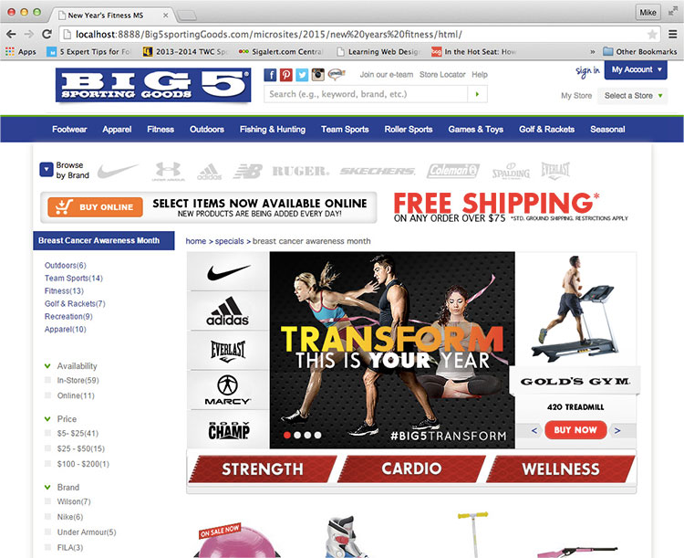

  
`big5sportinggoods.com`  

# Dates:  
2015  
# Technologies:  
HTML5, CSS3, jQuery plugin  
# Description:  
This microsite encourages fitness for the new year.  It has links along the left side which focus on individual brands.  The middle secion uses a jQuery plugin carousel called [Flexslider by WooThemes - http://www.woothemes.com/flexslider](http://www.woothemes.com/flexslider/).  Along the right side is another Flexslider carousel which cycles through individual items.  Navigation is on the bottom with links to categories of items for sale.  

In the **index.html**,  
The CSS styles I created are between the comments  
`<!-- Michael de Leon's CSS styles.  CUT HERE. CUSTOM CSS BEGIN -->`  
and  
`<!-- Michael de Leon's CSS styles.  CUT HERE. CUSTOM CSS END -->`  

My HTML code are between the comments  
`<!-- Michael de Leon's code.  CUT HERE. CUSTOM CODE BEGIN -->`  
and  
`<!-- Michael de Leon's code.  CUT HERE. CUSTOM CODE END -->`  
# Screenshots:
  
